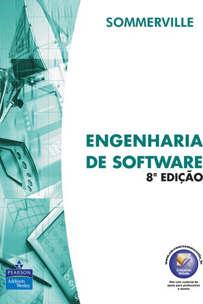

# Livro: Engenharia de Software (Sommervile, 2007)

```{r echo=FALSE, fig.show="hold", out.width="50%", fig.align = "center",fig.cap="Livro: Engenharia de Software (Sommervile, 2007)"}

```

## Parte 2 - Requisitos ( Capítulo 6 - Requisitos de Software )

* O QUE É a **engenharia de requisitos** ?
  * É um processo de comunicação
    * Entre clientes, usuários e desenvolvedores
  * NÃO É simplesmente um processo técnico
* Com o que a **engenharia de requisitos** ESTÁ RELACIONADA ?
  * ESTÁ RELACIONADA com O QUE o sistema irá fazer;
  * ESTÁ RELACIONADA com a definição das PROPRIEDADES EMERGENTES do sistema
    * Propriedades emergentes ESSENCIAIS
    * Propriedades emergentes DESEJÁVEIS
  * ESTA RELACIONADA com as RESTRIÇÕES do sistema
    * Restrições quanto A OPERAÇÃO
    * Restrição quanto AO PROCESSO DE DESENVOLVIMENTO DE SOFTWARE
    
* A **PARTE 2** do livro trata:
  * Das **BASES** DA ENGENHARIA DE SOFTWARE ( Capítulos 6 e 7 )
    * **Requisitos de Software**
      1. o que são requisitos ?
      2. Quais os tipos de requisitos ?
      3. Como os requistios devem ser organizados ?
    * **Atividades do Processo de Software**
      1. Estudos de viabilidade;
      2. Técnicas de **elicitação** de requisitos;
      3. Técnicas de **análise** de requisitos;
      4. **Validação** de requisitos;
  * Da DESCRIÇÃO DOS **MODELOS** E **TÉCNICAS** ( Capítulos 8 e 9 )
    * Tipos de modelos de sistemas
      1. Modelagem orientada a objeto
    * Especificação de sistemas críticos
      1. Propriedades emergentes **de confiança**
      2. Abordagem **dirigida a riscos**
      3. Tópicos específicos de **especificação**:
          a. De **segurança**
          b. De **confiança**
          c. De **proteção**
      4. Técnicas e métodos formais de especificação de requisitos
      
### Quais os objetivos deste capítulo ? {-}

* Apresentar os requisitos de sistemas de software;
* Explicar diferentes modos de expressar os requisitos de software.

### Quais as competências esperadas ao final do capítulo ? {-}

1. CONHECIMENTO a respeito dos conceitos de:
  * Requisitos de usuário;
  * Requisitos de sistema;
2. CONHECIMENTO do porquê da necessidade de expressar (escrever) de forma diferente os requisitos funcionais e os requisitos não funcionais
3. HABILIDADE de organizar os requisitos em um *DOCUMENTO DE REQUISITOS DE SOFTWARE**

### Requisitos de Software

* **Requisitos** de software são:
  1. **DESCRIÇÃO DOS SERVIÇOS** fornecidos pelo sistema;
  2. As **RESTRIÇÕES** operacionais do sistema
* **Engenharia de requisitos** (RE - Requirements Engineering) é o **processo** de:
  * Descobrir serviços e restrições de software;
  * Analisar serviços e restrições de software;
  * Documentar serviços e restrições de software;
  * Verificar serviços e restrições de software;


    
### Requisitos funcionais e Não Funcionais

Lorem ipsum. Lorem ipsum. Lorem ipsum. Lorem ipsum. Lorem ipsum. Lorem ipsum. Lorem ipsum. Lorem ipsum. Lorem ipsum. Lorem ipsum. Lorem ipsum. Lorem ipsum. Lorem ipsum. Lorem ipsum. Lorem ipsum. Lorem ipsum. Lorem ipsum. Lorem ipsum. Lorem ipsum.

### Requisitos de usuário

Lorem ipsum. Lorem ipsum. Lorem ipsum. Lorem ipsum. Lorem ipsum. Lorem ipsum. Lorem ipsum. Lorem ipsum. Lorem ipsum. Lorem ipsum. Lorem ipsum. Lorem ipsum. Lorem ipsum. Lorem ipsum. Lorem ipsum. Lorem ipsum. Lorem ipsum. Lorem ipsum. Lorem ipsum.

### Requisitos de sistema

Lorem ipsum. Lorem ipsum. Lorem ipsum. Lorem ipsum. Lorem ipsum. Lorem ipsum. Lorem ipsum. Lorem ipsum. Lorem ipsum. Lorem ipsum. Lorem ipsum. Lorem ipsum. Lorem ipsum. Lorem ipsum. Lorem ipsum. Lorem ipsum. Lorem ipsum. Lorem ipsum. Lorem ipsum.

### Especificação de interface

Lorem ipsum. Lorem ipsum. Lorem ipsum. Lorem ipsum. Lorem ipsum. Lorem ipsum. Lorem ipsum. Lorem ipsum. Lorem ipsum. Lorem ipsum. Lorem ipsum. Lorem ipsum. Lorem ipsum. Lorem ipsum. Lorem ipsum. Lorem ipsum. Lorem ipsum. Lorem ipsum. Lorem ipsum.

### Documento de requisito de software (DRS)

Lorem ipsum. Lorem ipsum. Lorem ipsum. Lorem ipsum. Lorem ipsum. Lorem ipsum. Lorem ipsum. Lorem ipsum. Lorem ipsum. Lorem ipsum. Lorem ipsum. Lorem ipsum. Lorem ipsum. Lorem ipsum. Lorem ipsum. Lorem ipsum. Lorem ipsum. Lorem ipsum. Lorem ipsum.

### Pontos chave, leituras sugeridas e exercícios {-}

Lorem ipsum. Lorem ipsum. Lorem ipsum. Lorem ipsum. Lorem ipsum. Lorem ipsum. Lorem ipsum. Lorem ipsum. Lorem ipsum. Lorem ipsum. Lorem ipsum. Lorem ipsum. Lorem ipsum. Lorem ipsum. Lorem ipsum. Lorem ipsum. Lorem ipsum. Lorem ipsum. Lorem ipsum.